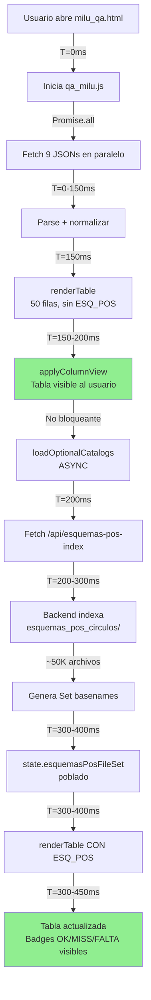
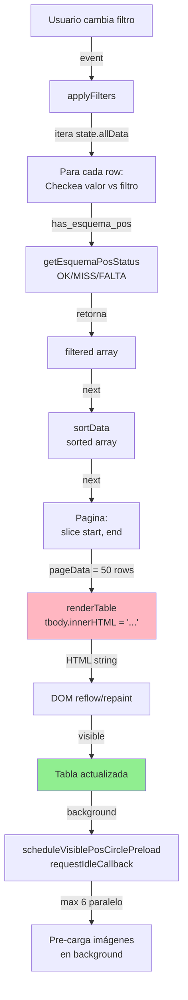
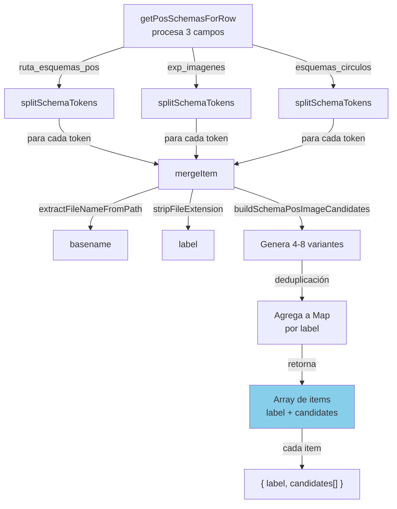

# Diagramas y Flujos: Visualización del Sistema

Representaciones visuales de los procesos principales del sistema de imágenes en MILU.

---

## 🔄 Flujo 1: Generación de Imágenes (Offline)

```
┏━━━━━━━━━━━━━━━━━━━━━━━━━━━━━━┓
┃  Fuentes Externas            ┃
┃ - PDFs con imágenes          ┃
┃ - Catálogos Excel            ┃
┃ - SharePoint / S3            ┃
┗━━━━━━━┬━━━━━━━━━━━━━━━━━━━━┛
        │
        ├─→ Extracción manual
        │   o scripts R
        │
        ↓
┏━━━━━━━━━━━━━━━━━━━━━━━━━━━━━━┓
┃  Almacenamiento Local        ┃
┃ ├─ fotos_articulos/          ┃
┃ ├─ fotos_motores/            ┃
┃ ├─ esquemas/                 ┃
┃ └─ esquemas_pos_circulos/    ┃
┃   (~50K archivos)            ┃
┗━━━━━━━┬━━━━━━━━━━━━━━━━━━━━┛
        │
        │ Procesamiento
        │
        ↓
┏━━━━━━━━━━━━━━━━━━━━━━━━━━━━━━┓
┃  depuracion_json.py          ┃
┃ ✓ Normalización              ┃
┃ ✓ Validación                 ┃
┃ ✓ Cálculo exp_imagenes       ┃
┗━━━━━━━┬━━━━━━━━━━━━━━━━━━━━┛
        │
        ↓
┏━━━━━━━━━━━━━━━━━━━━━━━━━━━━━━┓
┃  engine_*.json               ┃
┃  (9 archivos, 67K items)     ┃
┃ ✓ ruta_foto                  ┃
┃ ✓ ruta_esquemas_pos          ┃
┃ ✓ exp_imagenes (FINAL)       ┃
┗━━━━━━━┬━━━━━━━━━━━━━━━━━━━━┛
        │
        │ Síntesis
        │
        ↓
┏━━━━━━━━━━━━━━━━━━━━━━━━━━━━━━┓
┃  generate_synthetic_exports  ┃
┃ ✓ Agrupa por PN              ┃
┃ ✓ Deduplica imágenes         ┃
┗━━━━━━━┬━━━━━━━━━━━━━━━━━━━━┛
        │
        ├─→ qa_synthetic_new.json
        └─→ qa_synthetic_superseded.json
```

---

## 🌐 Flujo 2: Carga en milu_qa (Startup)

```
┏━━━━━━━━━━━━━━━━━━━━━━━━━━━━━━┓
┃  Usuario abre milu_qa.html   ┃
┗━━━━━━━┬━━━━━━━━━━━━━━━━━━━━┛
        │
        │ T=0ms
        │
        ↓
┏━━━━━━━━━━━━━━━━━━━━━━━━━━━━━━┓
┃  Inicia qa_milu.js           ┃
┗━━━━━━━┬━━━━━━━━━━━━━━━━━━━━┛
        │
        │ T=0-100ms
        │
        ↓
┏━━━━━━━━━━━━━━━━━━━━━━━━━━━━━━┓
┃  loadPartitionedEngineData() ┃
┃ Promise.all([9 JSONs])       ┃
┗━━━━━━━┬━━━━━━━━━━━━━━━━━━━━┛
        │
        │ T=100-200ms
        │
        ↓
┏━━━━━━━━━━━━━━━━━━━━━━━━━━━━━━┓
┃  state.allData = [67K items] ┃
┃  Parse + normalización       ┃
┗━━━━━━━┬━━━━━━━━━━━━━━━━━━━━┛
        │
        │ T=200ms
        │
        ↓
    ╔═══════════════════════════════════╗
    ║  TABLE APPEARS (sin ESQ_POS info) ║
    ╚═══════════════════════════════════╝
        │
        │ renderTable()
        │ (50 first rows, no badges yet)
        │
        ├──────────────────────────────┐
        │                              │
    BLOQUEANTE              NO BLOQUEANTE
        │                              │
        │                          T=200ms
        │                              │
        ↓                              ↓
   applyColumnView()      loadOptionalCatalogs()
   (10-20ms)                  (ASYNC)
                                │
        │                       │ fetch /api/esquemas-pos-index
        │                       │ (50-100ms)
        │                       │
        │                       ↓
        │               Backend indexa
        │               esquemas_pos_circulos/
        │               (~300-500ms, first time)
        │
        │                       │
        │               T=300-400ms
        │                       │
        │                       ↓
        │          state.esquemasPosFileSet
        │               = Set(basenames)
        │                       │
        │                       ↓
        │            renderTable()
        │         (con ESQ_POS info)
        │
        └──────────────────────────────┘
                       │
                       │ T=350-450ms
                       │
                       ↓
        ╔════════════════════════════════╗
        ║  TABLA ACTUALIZADA              ║
        ║  OK/MISS/FALTA badges visible  ║
        ╚════════════════════════════════╝
```

---

## 📊 Flujo 3: Usuario Selecciona Fila

```
┌─────────────────────────────┐
│ Usuario hace click en fila  │
└──────────────┬──────────────┘
               │
               ↓
    ┌──────────────────────┐
    │ Evento click en tbody│
    └──────────┬───────────┘
               │
               ├─→ Extrae revision-key
               │
               ↓
    ┌──────────────────────────────┐
    │ state.selectedRevisionRowKey  │
    │ = revision-key               │
    └──────────┬───────────────────┘
               │
               ├─→ refreshSelectedRowVisual()
               │   (Agrega clase row-selected)
               │
               ↓
    ┌──────────────────────────────┐
    │ row = state.allData.find()   │
    │ (busca por revision-key)     │
    └──────────┬───────────────────┘
               │
               ├─→ renderSelectedRowPosPanel(row)
               │   │
               │   ├─→ getPosSchemasForRow(row)
               │   │   (procesa 3 campos)
               │   │
               │   ├─→ buildPosStrip()
               │   │   (renderiza HTML con imágenes)
               │   │
               │   └─→ setSchemaImageSource()
               │       (setea src de img)
               │
               ├─→ updateSchemasInline(book, page)
               │   (actualiza panel 1)
               │
               └─→ dispatchSelectionChanged()
                   (eventos personalizados)
                   
               ↓
    ╔═════════════════════════════╗
    ║  PANELS LATERALES UPDATES   ║
    ║  (imágenes de posición)     ║
    ╚═════════════════════════════╝
```

---

## 🔍 Flujo 4: Validación ESQ_POS (getEsquemaPosStatus)

```
Input: row
  │
  ├─→ getPosSchemasForRow(row)
  │   │
  │   ├─→ Procesa ruta_esquemas_pos
  │   │   └─→ splitSchemaTokens() → ["URL1", "URL2", ...]
  │   │
  │   ├─→ Procesa exp_imagenes (NUEVO)
  │   │   └─→ splitSchemaTokens() → ["URL1", "URL2", ...]
  │   │
  │   ├─→ Procesa esquemas_circulos
  │   │   └─→ splitSchemaTokens() → ["URL1", "URL2", ...]
  │   │
  │   └─→ Retorna:
  │       [
  │         { label: "img1", candidates: [4 variantes] },
  │         { label: "img2", candidates: [4 variantes] },
  │         ...
  │       ]
  │
  ├─→ Si posItems.length === 0
  │   └─→ Retorna 'empty'
  │
  ├─→ Para cada posItem:
  │   │
  │   └─→ Para cada candidate:
  │       │
  │       ├─→ basename(candidate)
  │       │   └─→ extrae filename
  │       │   └─→ lowercase
  │       │   └─→ decode URL
  │       │
  │       └─→ state.esquemasPosFileSet.has(basename)
  │           └─→ O(1) búsqueda en Set
  │
  ├─→ Si ANY existe en Set
  │   └─→ Retorna 'ok' ✅
  │
  └─→ Si NONE existe en Set
      └─→ Retorna 'missing' ❌

Output: 'ok' | 'missing' | 'empty'
```

---

## 📤 Flujo 5: Cálculo de exp_imagenes (depuracion_json.py)

```
Input: record
  │
  ├─→ Inicializa: imagenes = []
  │
  ├─→ ¿Tiene ruta_foto?
  │   │
  │   ├─ SÍ:
  │   │   ├─→ ¿Es placeholder?
  │   │   │   │
  │   │   │   ├─ NO:
  │   │   │   │   └─→ imagenes.append(ruta_foto)
  │   │   │   │
  │   │   │   └─ SÍ:
  │   │   │       └─→ (ignorar)
  │   │   │
  │   │   └─→ logging
  │   │
  │   └─ NO:
  │       └─→ (siguiente)
  │
  ├─→ ¿Tiene ruta_esquemas_pos?
  │   │
  │   ├─ SÍ:
  │   │   ├─→ ¿Es placeholder?
  │   │   │   │
  │   │   │   ├─ NO:
  │   │   │   │   └─→ imagenes.append(ruta_esquemas_pos)
  │   │   │   │
  │   │   │   └─ SÍ:
  │   │   │       └─→ (ignorar)
  │   │   │
  │   │   └─→ logging
  │   │
  │   └─ NO:
  │       └─→ (siguiente)
  │
  ├─→ ¿imagenes[] tiene elementos?
  │   │
  │   ├─ SÍ:
  │   │   └─→ exp_imagenes = ", ".join(imagenes)
  │   │       (URL, URL, URL)
  │   │
  │   └─ NO:
  │       └─→ exp_imagenes = DEFAULT_PLACEHOLDER
  │           "https://...sin_imagen.jpeg"
  │
  └─→ record['exp_imagenes'] = exp_imagenes

Output: record con exp_imagenes calculado
```

---

## 🔗 Flujo 6: Construcción de Candidatos

```
Input: buildSchemaPosImageCandidates(book="12V4000M40A", rawToken="...")
  │
  ├─→ extractFileNameFromPath(rawToken)
  │   └─→ "https://.../12V4000M40A-0001-01-50.webp" → "12V4000M40A-0001-01-50.webp"
  │
  ├─→ stripFileExtension()
  │   └─→ "12V4000M40A-0001-01-50.webp" → "12V4000M40A-0001-01-50"
  │
  ├─→ Extrae extensión
  │   └─→ "webp"
  │
  ├─→ Define nombres:
  │   ├─ "12V4000M40A-0001-01-50"  (como está)
  │   └─ "12v4000m40a-0001-01-50"  (lowercase, si no comienza con book_lower)
  │
  ├─→ Define extensiones:
  │   ├─ Si tiene extensión → usar esa sola
  │   └─ Si no → intentar: ["webp", "png", "jpg", "jpeg"]
  │
  ├─→ Para cada (nombre, extensión):
  │   │
  │   └─→ esquemas_pos_circulos/{BOOK}-POS/{nombre}.{ext}
  │
  └─→ Retorna: [candidato1, candidato2, candidato3, ...]

Output: Array de 4-8 candidatos (paths locales)
```

---

## ⚙️ Flujo 7: Error Handling en Fallback de Imágenes

```
┌─────────────────┐
│ img.src = URL0  │
└────────┬────────┘
         │
    ┌────────────────────────────┐
    │ Browser intenta cargar URL │
    └────────┬───────────────────┘
             │
         ┌───┴───┐
         │       │
       OK?     ERROR?
         │       │
         ↓       ↓
       ✅      ❌
      Done    img.onerror dispara
                   │
                   ├─→ currentIdx = 0
                   │
                   ├─→ nextIdx = currentIdx + 1
                   │
                   ├─→ ¿nextIdx < candidates.length?
                   │   │
                   │   ├─ SÍ:
                   │   │   ├─→ link.href = candidates[nextIdx]
                   │   │   ├─→ img.src = candidates[nextIdx]
                   │   │   │
                   │   │   └─→ img.onerror dispara NUEVAMENTE
                   │   │       (cascada en serie)
                   │   │
                   │   └─ NO:
                   │       ├─→ No hay más candidatos
                   │       └─→ link.remove()
                   │           (elimina del DOM)
```

---

## Diagrama Mermaid: Proceso Completo de Startup



---

## Diagrama Mermaid: Flujo de Filtros y Paginación



---

## Diagrama Mermaid: Resolución de Candidatos de Imagen



---

## Diagrama ASCII: Stack de Tecnologías

```
┌─────────────────────────────────────────┐
│          BROWSER (Frontend)              │
├─────────────────────────────────────────┤
│  qa_milu.html (estructura)              │
│  + qa-milu.js (entry point)             │
│  + qa-table.js (rendering + filtros)    │
│  + schemas.js (image resolution)        │
│  + state.js (global state)              │
│  + pos-preload.js (background loading)  │
│  + styles/qa_milu.css (estilos)        │
└─────────────────────────────────────────┘
              ↕ HTTP/AJAX
┌─────────────────────────────────────────┐
│        NODE.JS BACKEND (Express)         │
├─────────────────────────────────────────┤
│  server.js                              │
│  + GET /api/esquemas-pos-index          │
│  + GET /save-json.php                   │
│  + GET /qa_revision_sync.php            │
│  + Static file serving                  │
└─────────────────────────────────────────┘
              ↕ Filesystem I/O
┌─────────────────────────────────────────┐
│           FILESYSTEM (Local)             │
├─────────────────────────────────────────┤
│  engine_*.json (9 archivos)             │
│  fotos_articulos/ (~12K imágenes)       │
│  esquemas_pos_circulos/ (~50K imágenes) │
│  qa_revision_server_data.json           │
└─────────────────────────────────────────┘
```

---

## Diagrama ASCII: Campos de Imagen en JSON Record

```
┌────────────────────────────────────────────────────────────┐
│              Engine JSON Record                            │
├────────────────────────────────────────────────────────────┤
│                                                            │
│  ID: "123456"                                             │
│  PART NO.: "ABC-789"                                      │
│  engine_model: "12V4000M40A"                              │
│                                                            │
│  ┌─────────────────────────────────────────────────────┐ │
│  │ CAMPOS DE IMAGEN                                    │ │
│  ├─────────────────────────────────────────────────────┤ │
│  │                                                     │ │
│  │  ruta_foto (URL)                                   │ │
│  │  └─→ "https://.../0049976736.jpeg"                 │ │
│  │                                                     │ │
│  │  filename_foto (string)                            │ │
│  │  └─→ "0049976736.jpeg"                             │ │
│  │                                                     │ │
│  │  esquemas (CSV)                                    │ │
│  │  └─→ "12V4000M40A-0001-01.png, 12V4000M40A-0001-02.png" │
│  │                                                     │ │
│  │  esquemas_circulos (string)                        │ │
│  │  └─→ "12V4000M40A-0001-01-50.webp"                 │ │
│  │                                                     │ │
│  │  ruta_esquemas_pos (URL)                           │ │
│  │  └─→ "https://.../12V4000M40A-0001-01-50.webp"     │ │
│  │                                                     │ │
│  │  ┌──────────────────────────────────────────────┐  │ │
│  │  │ exp_imagenes (CSV URLs) ← CAMPO FINAL        │  │ │
│  │  │ "https://.../0049976736.jpeg,                │  │ │
│  │  │  https://.../12V4000M40A-0001-01-50.webp"    │  │ │
│  │  │  ↑                                            │  │ │
│  │  │  Usado en WordPress export                   │  │ │
│  │  └──────────────────────────────────────────────┘  │ │
│  │                                                     │ │
│  └─────────────────────────────────────────────────────┘ │
│                                                            │
│  Otros campos (PN, weight, norm, error_list, etc...)   │
│                                                            │
└────────────────────────────────────────────────────────────┘
```

---

## Timeline: Toda una Sesión Típica

```
T=0s      │ Usuario abre milu_qa.html
          │
T=0.1s    │ Tabla visible (50 filas)
          │ Badges aún muestran "FALTA" (por defecto)
          │
T=0.3s    │ Tabla actualizada con ESQ_POS correcto
          │ OK/MISS badges aparecen
          │
T=0.3-1s  │ Pre-carga background de 6 imágenes
          │
T=1s      │ Sistema completamente cargado
          │ Usuario puede interactuar
          │
T=1.5s    │ Usuario hace click en fila
          │ Panel lateral renderiza imágenes
          │
T=1.5-2s  │ Lazy loading de imágenes en viewport
          │
T=2-10s   │ Usuario scrollea, filtra, cambia página
          │ Cada cambio: 50-100ms renderTime
          │ Imágenes cargan bajo demanda (lazy)
          │
T=10s     │ Si alguna imagen falla:
          │ Intenta candidato 2 (1s espera)
          │ Si también falla: candidato 3 (1s)
          │ Max 4 intentos = 4s timeout
          │
T=30s+    │ Sesión continúa...
          │ Memory footprint: ~15-30 MB
```

---

**Última actualización**: May 11, 2026  
**Basado en commit**: ad1737f0
